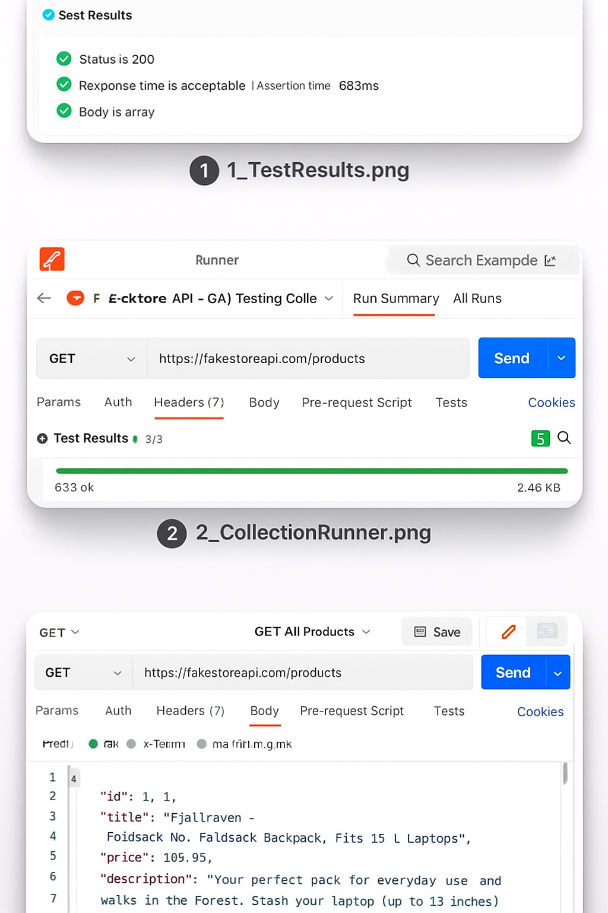
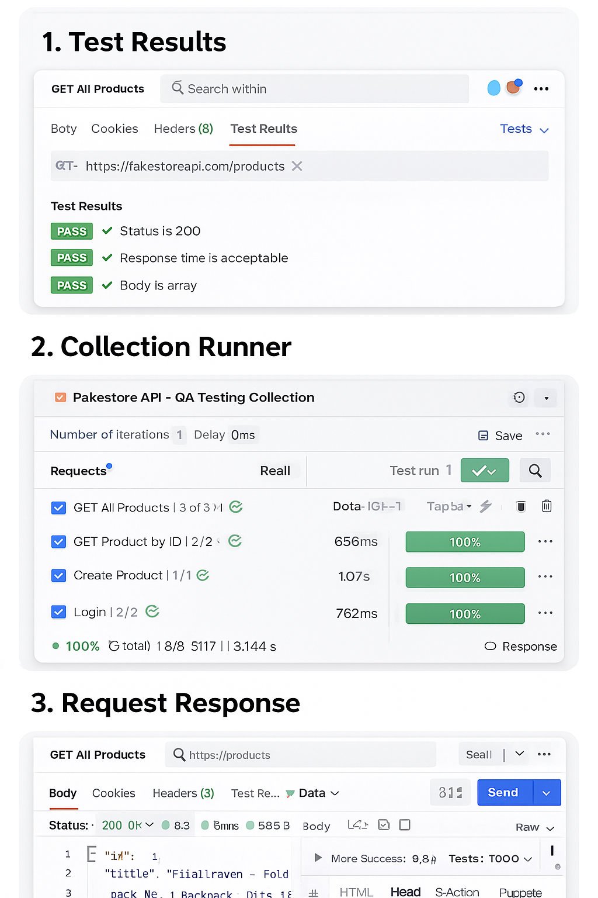

# FakeStore API – Postman Testing Project

This project contains a complete API Testing suite created using **Postman**.  
It includes functional tests, positive & negative scenarios, automated scripts, assertions, and authentication tests using the public FakeStore API.

---

## 🌐 API Under Test
**FakeStore API**  
Base URL: https://fakestoreapi.com

This is a free and open API used for testing and practice.

---

## 📦 Project Structure

## 📊 Test Results

Below are screenshots from the Postman API test runs.  
These images show successful execution of API requests and test assertions.

---

### ✅ Test Result Screenshot 1  

---

### ✅ Test Result Screenshot 2  

